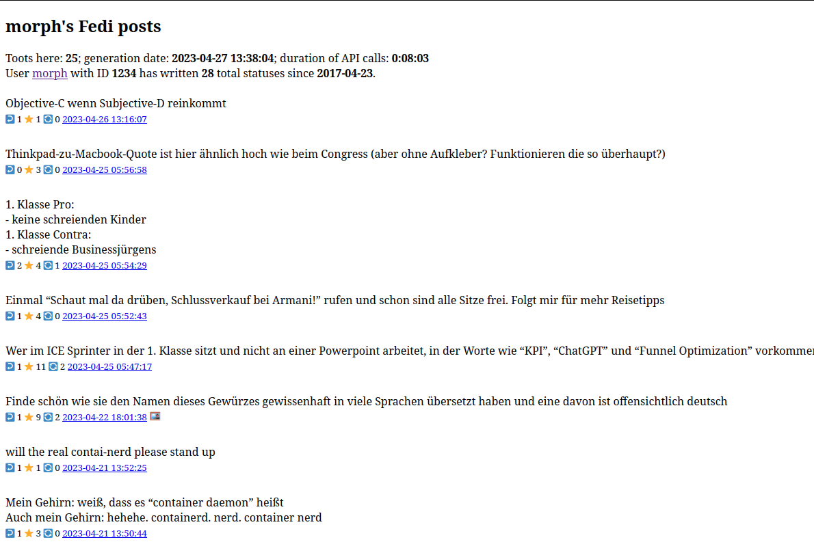

# masto-archiver
This script solves the pressing problem of accidentally making the same banger shitpost twice. If you run this, say, once a day, you can Ctrl+f through your previous posts to avoid that embarassing situation.

Demo page: https://masto-archive-demo.morph.sh

More precisely, this script gets all of your Mastodon posts from your instance's API and displays them on an HTML page. On most Mastodon instances, full-text search is not supported, so there's no easy way to search through your posts.

## Dependencies and Deployment
You will need `Mastodon.py` and `jinja2`. Install them using pip: `pip install Mastodon.py jinja2`

After cloning this repository, fill in your data in `secret.py` (most importantly the instance address and a Mastodon access token that has the `read:accounts` and `read:statuses` scopes set).

For convenient usage, you may want to automate running this script every so often (once a day or every few days should be enough) and copying the output to a webserver where you can view it.

## Usage
Simply run `python archive.py`. The output will be written to a file named `index.html` in the same directory.

To search through your posts, just open index.html and use your web browser's "Find on Page" feature (Ctrl+F takes you there usually) to search with the keywords that you remember from the post you're looking for. If you remember the rough date of the post you need to find, you can search for something like "2022-10" to get all posts from that month, because the dates adhere to ISO 8601.

## Warning!
- The output of this thing includes only public and unlisted toots by default (meaning, the same posts anyone can see by browsing your profile). In `secret.py`, you can configure it to also display private or direct toots, which should of course be kept private, so if you enable that, make sure to put the page in a place where only you can see it.
- This script is in no way optimized for speed. It can take a long time depending on the Mastodon server and the number of toots, especially if it runs into rate limits.

## To Do
- [x] include replies to yourself
- [ ] optionally include replies to others
- [x] configurable private / unlisted / direct toots
- [x] indicate if post has a media attachment
- [x] show spoilers
- [x] show polls
- [x] Date Formatting
- [x] improve margins and such
- [x] Change to HTML Templating engine
- [x] Secrets File
- [x] Usage Instructions
- [x] Screenshot for Github
- [x] Demo page
- [ ] Client-side search?